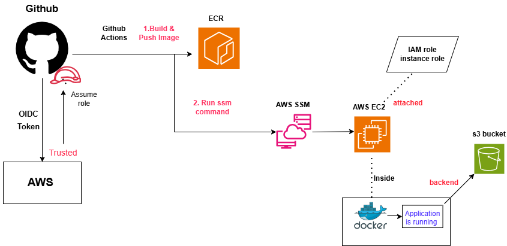

# 🚀 CI/CD Pipeline with GitHub Actions + AWS (OIDC, ECR, EC2, SSM, S3)

This project demonstrates a complete end-to-end CI/CD pipeline using GitHub Actions and AWS.

The pipeline:
- Builds a Docker image
- Pushes it to Amazon ECR
- Deploys it to an EC2 instance via AWS SSM
- Runs an application that uploads files to S3

---

# 🧠 Architecture Flow

---

# ⚙️ Prerequisites

## 🖥️ EC2 Instance Setup

Make sure your EC2 instance has:

- Docker installed
- AWS CLI installed
- SSM Agent installed and running

### Install Docker
```bash
sudo apt update
sudo apt install docker.io -y
sudo systemctl start docker
sudo systemctl enable docker
```

### Install AWS CLI
```bash
sudo apt install awscli -y
```

### Install SSM agent (if not already)
```bash
sudo snap install amazon-ssm-agent --classic
sudo systemctl start snap.amazon-ssm-agent.amazon-ssm-agent.service
```

## 🔐 IAM Requirements
1. EC2 Instance Role

Attach an IAM role with:

ECR read access
SSM permissions
S3 access
2. GitHub OIDC Role

Create an IAM role:

Github-oidc-role-ecr-ssm

Permissions:

*ECR (push/pull)
*SSM (send-command)

Trust relationship:

*GitHub OIDC provider

## ⚙️ GitHub Repository Setup
Variables (Settings → Variables)
AWS_ACCOUNT_ID
INSTANCE_ID
Secrets (Settings → Secrets)
AWS_REGION
S3_BUCKET

These will be passed to the container as environment variables.

## GitHub Actions Workflow
### 🏗️ Build Job
Checkout Code
```
- name: Checkout code
  uses: actions/checkout@v3
```
Configure AWS (OIDC)
```
- name: Configure AWS
  uses: aws-actions/configure-aws-credentials@v4
  with:
    role-to-assume: arn:aws:iam::<ACCOUNT_ID>:role/Github-oidc-role-ecr-ssm
    aws-region: ap-south-1
```
Login to ECR
```
- name: Login to ECR
  uses: aws-actions/amazon-ecr-login@v2
```
Build and Push Docker Image
```
IMAGE_URI=<ACCOUNT_ID>.dkr.ecr.ap-south-1.amazonaws.com/test-s3:latest

docker build -t $IMAGE_URI .
docker push $IMAGE_URI
```
### 🚀 Deploy Job (via SSM)
Send Command to EC2
```
aws ssm send-command
```

This runs commands remotely on the EC2 instance.

### 🧾 Deployment Commands Explained
Start Docker
```
sudo systemctl start docker
```
Login to ECR
```
aws ecr get-login-password --region ap-south-1 \
| docker login --username AWS --password-stdin <ACCOUNT_ID>.dkr.ecr.ap-south-1.amazonaws.com
```
Pull Latest Image
```
docker pull <IMAGE_URI>
```
Stop and Remove Old Container
```
docker stop app || true
docker rm app || true
```
Run New Container
```
docker run -d \
  --name app \
  -e AWS_REGION=<AWS_REGION> \
  -e S3_BUCKET=<S3_BUCKET> \
  -p 3000:3000 \
  <IMAGE_URI>
```
## 🌍 Environment Variables

These are injected into the container:

Variable	Description
AWS_REGION	
*AWS region for SDK
S3_BUCKET	
*S3 bucket for file uploads
### 📦 Application
Simple UI for uploading files
Files are stored in S3
Runs inside Docker container on EC2
### 🔐 Security Highlights
No AWS credentials stored in GitHub
Uses OIDC (short-lived credentials)
Deployment via SSM (no SSH required)

